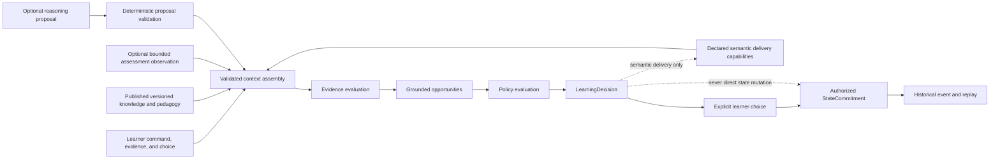

# Math Lumina Learning Engine

> **A deterministic, headless, evidence-centred learning engine for mathematics.**
>
> The engine constructs grounded learning decisions from qualified context, versioned knowledge, pedagogy, policy, learner evidence, and declared delivery capabilities. It deliberately separates a recommendation from learner consent, learning evidence from interpretation, and interpretation from authoritative learner state.

## Start here

**[FOUND-BY-USE.md](FOUND-BY-USE.md)** — every defect that mattered in this
project was found by someone using it, not by anyone reading it. That file is
the ledger, including the one that answered a learner's "stop" by starting them,
live in the engine while 126 tests passed around it.

It is the most useful thing here for anyone who will never open the product.

## Status

Math Lumina is a **headless deterministic learning engine** with two thin
surfaces over it. The engine holds every rule; the surfaces hold none.

| | |
|---|---|
| **Governing order** | [`foundation/`](foundation/) — articles A1–A8, adopted 2026-08-29 by [ADOPTION.md](foundation/ADOPTION.md) |
| **Enforcement** | 120 rules with a test or build gate behind them, 6 marked `by review` because nothing enforces them — see the [map](foundation/README.md) |
| **Tests** | 225 in `pnpm check`, plus 7 live provider tests kept outside it so no ordinary run costs money or touches a network |
| **Corpus** | 2 topics, 12 concepts, 27 relationships, 122 assets, 76 learning experiences |
| **Surfaces** | `pnpm learn` (terminal) and `pnpm ui` (browser, `127.0.0.1`) — both run the same engine |
| **Deployed** | <https://sifisoscs.github.io/sifiso-lumina-math/> — a static page, no server, no account, build-verified to contain no network primitive |
| **Open questions** | O1–O3, O5, O6 open; O4 and O7–O9 closed as A8 amendments — see [OPEN.md](foundation/OPEN.md) |

### What changed from the earlier description

Two things in this README were true for a long time and are not true now, and
saying so is cheaper than letting the front door mislead:

- **A UI exists.** Two, in fact. The engine is still headless — neither surface
  makes a decision, and `cli/` and `web/` contain presentation only.
- **A real model is connected.** `anthropicReasoningPort` sits behind
  `ReasoningPort` and is live-verified against Claude Opus 5. It proposes; it
  authorises nothing; no learner-owned material can reach it, because
  `ConceptContent` has no field it could travel in.

The **D1–D55 constitutional corpus is superseded.** It is preserved untouched in
[`governance/historical/`](governance/historical/) as source material and
confers no authority. Anything below that refers to D-numbered decisions is
describing history, not the governing order.

## Design purpose

Math Lumina is not an application, tutoring interface, content-management system, or assessment platform. It is the **deterministic learning authority kernel** beneath possible future clients. A web, mobile, voice, agent/tutor, or accessibility-oriented client can interact with it only by providing semantic context and declared capabilities. The engine does not inspect a device, detect a browser, infer client abilities, or encode screen-level behavior.

The engine’s core responsibility is narrowly defined:

> **Given valid, explicit, versioned, and policy-permitted inputs, construct a deterministic and explainable learning decision. Only a learner-originated authorization may later permit the limited state transition associated with a selected path.**

## Core guarantees

| Guarantee | Meaning |
|---|---|
| **Headless and client-neutral** | No rendering model, screen flow, browser/device detection, UI state, API transport, or framework dependency is present. |
| **Deterministic** | Identical qualified inputs and referenced versions produce the same decision. No randomness, hidden provider behavior, or ambient client state is used. |
| **Evidence-centred** | Observed evidence, derived interpretation, and authoritative learner state are distinct. |
| **Learner-respecting** | An offer is not an instruction. Only explicit `select-offer` may authorize the selected path commitment. |
| **Non-mutating decisions** | A `LearningDecision` does not itself mutate learner state. State changes require an explicit `StateCommitment`. |
| **Knowledge-grounded** | Material decisions retain concept, asset, relationship, experience, and version provenance where used. |
| **Delivery-safe** | Declared client capabilities determine whether an experience is compatible; delivery/display is not completion or learning. |
| **Fail-closed** | Missing, invalid, stale, conflicting, unauthorised, or ungroundable critical input produces a safe or explicitly constrained result rather than fabricated certainty. |
| **Replayable state** | Ordered `state-committed` events and authoritative commitment deltas reconstruct current state deterministically. |
| **Provider-independent** | Assessment and AI reasoning are contract boundaries only. No provider is invoked, and neither may become final decision or state authority. |

## The engine boundary



The boundary is intentionally strict. Knowledge, curriculum, pedagogy, assessment, policy, client delivery, and AI may contribute bounded inputs in their own authority domains. They do not replace the deterministic engine’s decision construction, and none of them converts an offer into learner consent.

## Domain model

The engine is organized around five canonical domains and a small set of explicit contract boundaries.

| Domain | Responsibility |
|---|---|
| **Mathematical Knowledge** | Versioned domains, topics, concepts, relationships, assets, and semantic LearningExperience definitions. |
| **Learner Record** | Immutable learner-owned evidence, qualified interpretations, current-state projection, StateCommitments, and historical events. |
| **Pedagogical Model** | Presentation-independent Intuition, Mechanics, and Exam Patterns guidance and compatible experience intents. |
| **Learning Decisioning** | Context assembly, bounded knowledge resolution, evidence evaluation, opportunity construction, policy evaluation, decision construction, transitions, and replay. |
| **Policy & Governance** | Executable safeguards, learner autonomy, policy outcomes, validation boundaries, and explicit extension points. |

### Material and safe non-material decisions

A `LearningDecision` has one of two forms.

| Type | Contract |
|---|---|
| **Material** | Requires valid knowledge grounding and concept references. It may contain optional opportunities/offers or be an explicitly constrained, offerless material result where a grounded concept exists but a required path is unavailable. |
| **Safe non-material** | Is conceptless, actionless, offerless, and non-mutating. It records that the engine could not responsibly construct a grounded material decision from available context. |

A safe non-material result must never invent a concept, assessment conclusion, opportunity, offer, learner choice, or state effect.

## Learning decisions, offers, and learner choice

The engine distinguishes semantic recommendation from learner authorization.

```text
Grounded opportunity → LearningDecision → Offer → explicit learner choice → authorized StateCommitment
```

| Learner response | Meaning | State effect |
|---|---|---|
| `select-offer` | The learner accepts that currently valid offer. | May authorize a commitment to the selected concept/layer path. It does not prove delivery, participation, completion, or learning. |
| `decline-offer` | The learner declines this offer now. | No move toward the declined path. No inferred dislike, inability, or permanent rejection. |
| `defer-offer` | The learner postpones this offer. | No path movement, consent, or implied future commitment. |
| `request-alternative` | The learner asks for a different option. | No path movement. A later decision may offer a grounded compatible alternative. |
| `pause` | The learner pauses engagement. | May explicitly set engagement focus to paused; it does not reject content or erase evidence. |

The engine never treats rendering, display, silence, correctness, curriculum sequence, academic context, or an AI suggestion as consent.

## Evidence, interpretation, and state

Math Lumina follows an **evidence-centred learning-state model**.

| Layer | Definition | Examples | Explicit limitation |
|---|---|---|---|
| **Observed evidence** | Immutable source-scoped record of what a learner supplied or an approved boundary observed. | Practice attempt, confidence report, reflection, learner choice, externally observed practice outcome. | Not a competence verdict. |
| **Derived interpretation** | Provisional, rule-versioned, evidence-linked deterministic interpretation. | Evidence supporting uncertainty; evidence-linked optional revisit support. | Not learner-owned speech, mastery, readiness, or permanent truth. |
| **Authoritative state projection** | Explicit current state built only from authorized StateCommitment deltas. | Engagement focus, active concept/layer, evidence/interpretation references. | Not mastery, readiness, promotion, learner-specific misconception, or a score. |

Conflicting observations remain visible. The engine must not discard evidence or manufacture a universal precedence rule. It may form only the optional, qualified decisions explicitly permitted by policy.

### Explicitly unavailable learner claims

Until separately authorized by future governance, the engine must not declare or infer:

- mastery, readiness, score, promotion, certification, or qualification progression;
- learner-specific misconception, ability, intelligence, motivation, personality, preference, or psychological state;
- correctness from an unassessed free-text answer;
- completion or learning from delivery, interaction availability, participation, selection, or experience lifecycle alone.

## Knowledge, curriculum, academic context, and relationships

### Mathematical knowledge versus curriculum

Canonical Mathematical Knowledge is independent of curriculum. A curriculum is a versioned, authority-scoped educational mapping over selected published knowledge; it may define scope, sequence, contextual expectation, representation preference, or academic-context mapping. It must not redefine mathematical concept semantics.

```text
Mathematical knowledge  ≠  Curriculum  ≠  Academic level  ≠  Progression  ≠  Assessment  ≠  Examination requirement
```

A shared concept may occur in several curricula, in different sequences or academic contexts. A curriculum requirement is not learner evidence, learner consent, learner capability, or academic advancement.

### Knowledge relationship discipline

A knowledge relationship is a typed, authority-scoped, versioned semantic claim between identifiable knowledge objects. Graph topology alone does not make an edge mathematically true, curriculum-applicable, pedagogically desirable, learner-specific, or state-authorizing.

| Relationship family | Meaning | Decisioning use |
|---|---|---|
| Mathematical prerequisite | Directed canonical semantic antecedent relationship. | May ground optional prerequisite-revisit opportunity only when authorized. It does not block access or establish learner readiness. |
| Related concept | Non-dependency association for bounded discovery/explanation. | May support discovery only when expressly authorised; it is not transitive or a hidden prerequisite. |
| Concept bridge | Directed optional conceptual/pedagogical connection. | May ground optional bridge/representation exploration; never a hidden prerequisite or diagnostic conclusion. |
| Representation relation | Connects a concept with a representation asset/form. | May ground compatible representation opportunity with an experience and declared delivery capability. |
| Curriculum mapping/sequence | Curriculum-scoped educational structure. | May inform curriculum-specific relevance only; cannot alter mathematics or force learner path. |
| Pedagogical route | Methodological/support connection. | Future optional use only under its own authority/policy. |

Only a relationship type explicitly authorized for a named decisioning purpose may influence that function.

## Learning experiences and delivery capability

A `LearningExperience` is a versioned semantic educational interaction definition. It is not a screen, UI flow, delivery client, participation record, assessment result, or learner outcome.

| Concept | Meaning |
|---|---|
| Experience definition | Authorized versioned interaction semantics: knowledge/pedagogy grounding, interaction requirements, evidence expectations, completion semantics, and delivery requirements. |
| Opportunity | A possible route generated by decisioning; may reference an experience. |
| Offer | An option made available in a LearningDecision; does not activate or deliver the experience. |
| Experience instance | A future distinct occurrence of a learner using a selected experience version. It is not currently implemented as a persistence/runtime feature. |
| Delivery capability | A client-declared semantic capability, such as `spoken-output`, `displayed-text`, `displayed-notation`, `visual-representation`, `typed-input`, or `spoken-input`. |
| Completion | A declared, version-specific lifecycle fact based on required interaction/evidence semantics. It is not mastery, readiness, correctness, progression, or learning. |

When no pedagogically relevant compatible experience is available for a grounded material context, the engine produces a deterministic constrained/declined material decision with no offer and no state effect. It never silently downgrades an experience to unrelated content or fabricates compatibility.

## Replay and historical integrity

State evolution is event-aware and replay-capable without introducing a database or event bus.

```text
Accepted command/evidence or learner choice
→ planned StateCommitment with explicit delta
→ causally linked HistoricalEvent
→ deterministic replay of ordered state-committed events
```

A `StateCommitment` is the authoritative source for a replayable state delta. Replay applies ordered commitments referenced by causal `state-committed` events and detects inconsistent references such as duplicate or missing commitments. It does not re-run contemporary decisioning, assess historical answers using current logic, invoke AI, or rewrite historical truth.

Historical decisions require structured provenance of causally material knowledge, relationship, experience, policy, evidence, assessment, curriculum, and version context as later approved. The present kernel preserves the principles and references; durable storage, historical retrieval, correction/supersession, ordering policy, and version migration remain intentionally deferred.

## Assessment and AI boundaries

### Assessment

Assessment is a bounded observation authority, not a hidden evaluator inside the engine. The existing `AssessmentBoundary` is a provider-neutral contract for externally supplied observed practice outcomes. `PracticeAttempt` deliberately does not score free-text learner responses.

An assessment observation is authoritative only as a narrow, provenance-bound statement from its recognized source regarding a defined interaction under named criteria/version context. It cannot directly create mastery, readiness, misconception, fluency, progression, promotion, or learner state.

### AI reasoning

`ReasoningPort` is a provider-neutral proposal boundary. A real provider now sits behind it — `anthropicReasoningPort`, live-verified against Claude Opus 5 — and the boundary is what makes that safe rather than the absence of a model.

What holds the line is structural, not procedural:

- **`AuthorizedAction` cannot be minted outside `src/governance/authorization.ts`.** An unexported brand symbol makes constructing one elsewhere a compile error, and a module-private `WeakSet` catches a forgery cast through `as`. 19 hostile attack kinds across 23 tests, including the ones that cannot be refused — documented as inert rather than papered over.
- **No learner-owned material can reach a provider.** Not by policy: `ConceptContent` has no field it could travel in, and `explanationTask` has no parameter for learner evidence.
- **A model's words reach a learner only as a labelled explanation** that commits nothing and changes no state (A5 v1.5).
- **Live provider tests live in `live/`, outside `pnpm check`,** so no ordinary test run makes a network call or spends money.

| AI may propose in a future governed phase | AI may not authoritatively determine |
|---|---|
| Explanation draft, alternative representation, practice candidate, relationship hypothesis, content/experience draft, or bounded decision/policy suggestion. | Correctness, assessment outcome, evidence sufficiency, mastery, readiness, learner-specific misconception, learner consent, policy outcome, final LearningDecision, StateCommitment, content publication, or historical modification. |

An unavailable or invalid proposal must leave deterministic engine behavior safe and unchanged.

## Governance

The governing order is [`foundation/`](foundation/): eight articles, adopted by
a human act recorded in [ADOPTION.md](foundation/ADOPTION.md), amended only
through A8.

| | Article | In one line |
|---|---|---|
| **A1** | Purpose | What Lumina is for, and who it serves |
| **A2** | Learner Agency | Choice is never inferred; declining is a real answer |
| **A3** | Authority | Who may decide what, and where the first authority comes from |
| **A4** | The Authority Seam | Capability is not authority; the line nothing crosses by being convincing |
| **A5** | AI Boundary | AI is the intelligence inside the system, never its sovereign |
| **A6** | Accountability | Every consequential action traces to a cause a person can inspect |
| **A7** | Fail-Closed | Do less when uncertain — and every hold must name its exit |
| **A8** | Amendment | How this order changes, preserves itself, and ends cleanly |

Governance here is **executable**. [`foundation/README.md`](foundation/README.md)
carries a map of every rule beside the test or build gate that fails when it is
broken, and marks the ones nothing enforces as `by review` rather than counting
them as enforced. A row claiming enforcement it does not have is treated as
worse than an admitted gap.

The previous order — 36 prose specifications, D1–D55 — could not lawfully
authorise anything: D1–D19 were lost, there was no amendment rule, and nothing
was checked by anything. It is preserved in
[`governance/historical/`](governance/historical/) and **confers nothing**.

## Repository structure

```text
src/
├── contracts/
│   ├── assessment-boundary.ts       # Replaceable external assessment observation boundary
│   ├── core-contracts.ts            # Commands, decisions, opportunities, offers, capability contracts
│   └── reasoning-port.ts            # Provider-neutral proposal and validation boundary
├── decisioning/
│   ├── context.ts                   # Validated decision context assembly
│   ├── knowledge-context.ts         # Bounded deterministic knowledge resolver
│   ├── evidence-evaluation.ts       # Observed evidence to qualified interpretation
│   ├── opportunities.ts             # Grounded candidate opportunity generation
│   ├── delivery-compatibility.ts    # Semantic client capability filtering and completion checks
│   ├── policy-evaluation.ts         # Policy outcome evaluation
│   ├── decision-construction.ts     # Material and safe non-material decision construction
│   ├── state-transitions.ts         # Authorized commitment and causal event planning
│   ├── learner-record-evolution.ts  # Immutable learner record evolution
│   ├── replay.ts                    # Deterministic commitment/event replay
│   └── engine.ts                    # Headless deterministic orchestration
├── domain/
│   ├── primitives.ts                # IDs, versions, timestamps, invariant helpers
│   ├── provenance.ts                # Structured observable provenance vocabulary
│   ├── mathematical-knowledge.ts    # Knowledge, assets, relationships, experiences
│   ├── learner-record.ts            # Evidence, interpretations, commitments, events, state
│   ├── pedagogical-model.ts         # Layered pedagogical guidance
│   └── policy-governance.ts         # Safeguards and governance extension points
├── governance/
│   ├── authorization.ts             # AuthorizedAction — mintable here and nowhere else
│   └── proposal-policy.ts           # Policies that gate proposals deterministically
├── providers/
│   ├── anthropic-reasoning-port.ts  # A real model behind ReasoningPort
│   └── reasoning-prompt.ts          # The prompt, and what it may not contain
├── seed/
│   ├── topic-seed.ts                # One topic's content, before assembly
│   ├── functions-seed.ts            # Functions — 8 concepts
│   ├── sequences-seed.ts            # Patterns and sequences — 4 concepts
│   ├── curriculum.ts                # The one catalogue, and the edges between topics
│   └── AUTHORSHIP.md                # Who drafted the corpus, and who is answerable
└── index.ts                          # Standalone public export surface

cli/                                  # Terminal surface — presentation only, no decisions
web/                                  # Browser surface — same engine, build-verified offline
test/                                 # Headless contract and behaviour tests (225)
test/hostile/                         # Attacks on the authority seam
live/                                 # Provider tests, deliberately outside `pnpm check`
foundation/                           # A1–A8, the adoption record, and the enforcement map
governance/historical/                # D1–D55, superseded, conferring nothing
demo/                                 # Deterministic, semantic demonstration scenarios
FOUND-BY-USE.md                       # The defect ledger — start here
SLICE-1-REPORT.md ... SLICE-5-REPORT.md
```

## Getting started

### Prerequisites

- Node.js compatible with the repository’s TypeScript and `tsx` tooling.
- `pnpm`.

### Install and verify

```bash
pnpm install
pnpm check
```

`pnpm check` runs strict TypeScript checking followed by the entire headless test suite.

### Run demonstrations

The demonstrations output semantic scenario data; they do not open a UI, browser, API, or service.

```bash
pnpm demo:slice2  # Deterministic decisioning scenario
pnpm demo:slice3  # Learner state evolution, commitments, events, and replay
pnpm demo:slice4  # Bounded knowledge and pedagogical context
pnpm demo:slice5  # Compatible and incompatible delivery-capability contexts
```

### Public contract surface

The engine exposes its domain, contract, seed, decisioning, delivery-compatibility, replay, and evolution modules through `src/index.ts`.

```ts
import {
  // Domain contracts, engine orchestration, deterministic resolver,
  // assessment/reasoning boundaries, replay, and seed content.
} from "math-lumina-learning-engine";
```

Consumers should use the types/contracts as semantic interfaces. They must not assume a UI object, transport request, persistence model, real AI provider, assessment service, or operational content-management system exists.

## Verification

```bash
pnpm check          # strict typecheck, then the full suite — 225 tests
pnpm learn          # the terminal surface
pnpm ui             # the browser surface, at 127.0.0.1
pnpm build:pages    # build, stage, and re-verify the deployable artefact
```

Two disciplines are worth stating because they decide what the numbers mean:

**Every guarantee is proven by breaking it.** A test is not accepted until the
code it defends has been deliberately broken and *that specific test* has been
watched failing. A test that passes for the wrong reason is worse than no test,
and this project has caught itself writing one.

**No path is wrong, not just the chosen one.** `test/learner-walk.test.ts` drives
the session layer with seeded pseudo-random orderings — including leaving and
returning — and holds every step to invariants that must hold whatever a learner
does. Raise `LUMINA_WALKS` for a longer soak; a failure names the seed that
reproduces it.

**The web artefact is gated, not just built.** `web/verify.mjs` fails the build
if the bundle ever gains `fetch(`, `XMLHttpRequest`, `WebSocket`,
`sendBeacon`, a dynamic `import(`, or anything `anthropic` — and if the page
itself gains any external URL, font, or iframe. The guarantee has to hold on the
artefact that reaches a learner, so publishing refuses if it changes.

The slice reports ([`SLICE-1-REPORT.md`](./SLICE-1-REPORT.md) through
[`SLICE-5-REPORT.md`](./SLICE-5-REPORT.md)) record the original Phase 2
implementation history and its test counts at the time.

## Explicit non-goals and deferred work

The following are intentionally absent and must not be inferred from the current engine:

| Deferred or prohibited area | Reason |
|---|---|
| Browser/device detection, screen flows, framework coupling *inside the engine* | The engine is interface-agnostic and semantic. Two surfaces exist in `cli/` and `web/`; neither makes a decision, and the engine cannot see them. |
| API transport, webhooks, queues, event bus, distributed execution | Runtime/infrastructure concerns remain outside the deterministic kernel. |
| Database, graph database, persistence, audit store | Retention, correction, sequencing, tenancy, retrieval, and deletion governance remain separate decisions. |
| CMS, content editor, curriculum authoring/publishing workflow | Content authority, validation, publication, lifecycle, and version governance are conceptual boundaries awaiting implementation approval. |
| Assessment service, evaluator, rubric, scoring, free-text correctness inference | Assessment remains an external replaceable observation boundary. |
| AI as an authority over anything | A real provider now sits behind `ReasoningPort`. It proposes and authorises nothing: `AuthorizedAction` cannot be minted outside `src/governance/authorization.ts`, and no learner-owned material has a field to travel in. |
| Mastery/readiness scoring, learner diagnosis, promotion, certification, grading | These claims require distinct authority, evidence sufficiency, policy, correction, and audit decisions. |
| Automatic prerequisite blocking, automatic progression, silent alternative substitution | These would violate learner choice, relationship, and delivery safeguards. |

## Contribution and change discipline

This repository is intentionally governed by incremental, explicitly approved slices. A contribution should preserve the following discipline:

1. **Do not expand authority implicitly.** New concepts such as mastery, readiness, content activation, assessment result, learner-specific diagnosis, or AI influence require approved semantic authority and provenance.
2. **Preserve existing contracts.** Material decisions remain grounded; safe non-material outcomes remain conceptless, actionless, offerless, and non-mutating.
3. **Keep the engine headless.** Do not add UI, browser, API, database, provider, or persistence coupling to core decisioning.
4. **Keep state explicit and replayable.** Do not mutate learner history; create only authorized commitments with explicit deltas and causal events.
5. **Test deterministically.** Add headless tests that prove invariants, failure behavior, idempotency, provenance, and replay implications without external services.
6. **Do not turn delivery or lifecycle into learning claims.** Client delivery capability, display, participation, selection, and completion remain distinct from evidence and learner state.
7. **Do not let AI or metadata become authority.** They may become bounded inputs/proposals only where explicitly approved.

## License and ownership

No open-source license is currently declared in this repository. All content, policy, publication, and authority treatment remains subject to the project’s explicit governance decisions.

---

Math Lumina is designed to remain **mathematically faithful, evidence-centred, deterministic, explainable, non-coercive, and client-independent** as it evolves through explicit human architectural approval.
